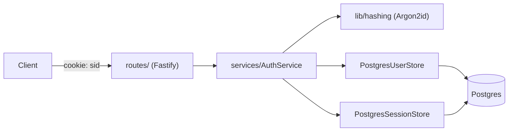

# TurtleAuth

A Clerk-class authentication platform, built module by module, as a learning project
following the *Authentication Engineering Roadmap*. Each module is a sprint; each sprint
ships a working increment of the service, not a toy.

Current state: **Module 1 — Authentication Foundations**, shipped as `v0.1.1`.
Password auth, server-side sessions, hardened cookies, HTTP layer — all backed by
Postgres.

---

## 1. Where things stand

| | |
|---|---|
| Version | `0.1.1` |
| Module | 1 of 6 — Authentication Foundations (see [roadmap](#8-roadmap--whats-next)) |
| Storage | Postgres (Prisma 7 + `@prisma/adapter-pg`) — in-memory stores from `v0.1.0` were fully replaced, not kept alongside |
| Tests | 74 passing (`vitest`), run against a real Postgres instance |
| CI | GitHub Actions — typecheck, build, test on Node 22 and 24 |
| Endpoints | `POST /auth/register`, `POST /auth/login`, `GET /auth/me`, `POST /auth/logout`, `POST /auth/logout-all`, `GET /health` |

**Known gaps, tracked deliberately rather than accidentally missed:**

- **No session reaper.** Expired sessions are rejected on read but never deleted in bulk —
  the `sessions` table grows unboundedly until a cleanup job exists. See
  `prisma/schema.prisma` (`@@index([expiresAt])` comment) and issue #1.
- **No rate limiting** on `/auth/login` or `/auth/register` yet — planned for Module 3.
- **No email verification** — registration auto-creates a session on an unverified
  address (documented in `src/routes/auth-routes.ts`). Fine for sign-in today, not a
  proof of inbox ownership.
- `src/server.ts` currently logs a **stale startup warning** claiming sessions are
  in-memory; that was true before this module's Postgres increment and needs updating.

---

## 2. Architecture

```
src/
├── server.ts          production entry point — binds the port, handles SIGTERM/SIGINT
├── app.ts             wiring only: builds a Fastify instance from its dependencies
├── config.ts          env var validation (zod) — fails fast on bad config, no silent fallback
├── core/
│   ├── types.ts        domain types (User, Session, Credential) — no HTTP, no SQL
│   └── errors.ts        AuthError taxonomy — publicMessage vs internal message
├── lib/hashing/
│   ├── hasher.ts        Hasher interface (algorithm-agnostic)
│   ├── argon2-hasher.ts Argon2id implementation (default)
│   └── bcrypt-hasher.ts bcrypt implementation (legacy-migration path)
├── services/
│   ├── auth-service.ts   all auth/session logic — no HTTP, no SQL, reusable from OAuth later
│   ├── user-store.ts     PostgresUserStore — users + credentials
│   └── session-store.ts  PostgresSessionStore — sessions
├── routes/
│   ├── auth-routes.ts    thin HTTP layer: validate input, call AuthService, set status/cookie
│   └── cookie.ts         session cookie flags, centralised in one place
└── db/
    └── client.ts         Prisma client construction (driver adapter + pool sizing)
```

**Layering rule (enforced, not aspirational):** only `db`/`services` know about
Postgres; only `routes` know about HTTP. `AuthService` has no SQL and no
`request`/`reply` anywhere in it — verified during the Postgres migration by checking
that swapping the storage layer required zero changes to its logic, only `await`.



### Data model

Three tables today (`prisma/schema.prisma`); Module 6 adds the remaining thirteen
(oauth_accounts, roles, permissions, mfa_methods, passkeys, audit_logs, ...).

```
users            id (uuid) · email (citext, unique) · email_verified_at · timestamps
credentials      id · user_id → users · type (password) · secret (self-describing hash)
                 unique(user_id, type)
sessions         id (the 256-bit session token itself, not a surrogate key)
                 user_id → users · expires_at · last_seen_at · ip · user_agent
                 index(user_id), index(expires_at)
```

Design decisions worth knowing before changing this schema — see
`discussions/02-postgres-persistence.md` for the full reasoning:

- **One identity, many credentials.** `User` holds no password hash; a password is just
  the first `Credential` type. This is what lets Module 4 (OAuth) and Module 5
  (passkeys) add credential types without touching `users`.
- **Email uniqueness is enforced by the database** (`CITEXT` + `UNIQUE`), not just
  application code. Registration inserts optimistically and catches the Postgres unique
  violation (`P2002`) rather than checking-then-inserting, which would race under
  concurrent signups.
- **Session `id` is the CSPRNG token itself** (32 bytes, base64url) — not a UUID with a
  separate secret. It's already unique and unguessable; a surrogate key would just be a
  second index for nothing.

### Session model

- **Two independent clocks**, both enforced server-side in `AuthService.validateSession`:
  - *Absolute lifetime* — 7 days from creation, no matter how active.
  - *Idle timeout* — 30 minutes since last use.
- The cookie's `Max-Age` is only a browser hint; expiry is always re-checked against the
  database on every request.
- A fresh, unrelated session id is minted on every login (defeats session fixation) and
  on logout the server-side row is deleted *and* the cookie is cleared — clearing only
  one half would leave a working stolen cookie or a dead cookie pointing at a live
  session.
- `__Host-sid` cookie name in production (browser-enforced Secure + host-only + `Path=/`);
  falls back to a plain `sid` name for local HTTP dev.

### Password handling

- **Argon2id** by default (OWASP first choice; memory-hard). A `Hasher` interface also
  has a bcrypt implementation, to support migrating an *existing* bcrypt-hashed user base
  onto Argon2id without a forced password reset — hashes are self-describing strings, so
  `needsRehash()` can detect an outdated algorithm or weaker params and upgrade
  transparently on next successful login.
- **Timing-safe "no such user" path.** A login against a non-existent email still runs a
  real Argon2 verify (against a hash of random bytes, generated once from the *live*
  hasher instance and cached) so that "wrong password" and "no such user" take the same
  time. The dummy hash is deliberately *not* a hardcoded string — tuning
  `ARGON2_MEMORY_COST` later would otherwise silently reopen the timing gap.
- Both `INVALID_CREDENTIALS` responses (bad password vs. unknown email) return the exact
  same HTTP 401 and message — the caller cannot distinguish them, so login cannot be used
  to enumerate registered accounts.

---

## 3. Getting started

**Prerequisites:** Node **>= 22** (the repo currently only has Node 20.20.2 active via
`nvm` on this machine — Node 22 is installed via `fnm`; run `eval "$(fnm env)"` or
otherwise put a 22+ `node` first on `PATH` before installing/running, or native modules
segfault under vitest's worker pool), `pnpm` 10, and Docker (for local Postgres).

```bash
# 1. Install dependencies (builds argon2/bcrypt native addons via postinstall)
pnpm install

# 2. Copy env and adjust if needed (defaults already match docker-compose)
cp .env.example .env

# 3. Start Postgres (waits for the healthcheck, not just container start)
pnpm db:up

# 4. Apply the schema
pnpm db:migrate      # first run / when the schema changes
# or: prisma migrate deploy   (non-interactive, e.g. in CI/prod)

# 5. Run the dev server (hot reload via tsx watch)
pnpm dev
```

Server listens on `http://localhost:3000` (configurable via `PORT`).

### Configuration (`.env`)

| Variable | Required | Default | Notes |
|---|---|---|---|
| `NODE_ENV` | no | `development` | `development` \| `test` \| `production` |
| `PORT` | no | `3000` | |
| `DATABASE_URL` | **yes** | — | Missing value stops the process at boot, on purpose |
| `ARGON2_MEMORY_COST` | no | `65536` (64 MiB) | KiB. Per-*concurrent-hash* cost — see comment in `src/config.ts` before raising it |
| `ARGON2_TIME_COST` | no | `3` | passes |
| `ARGON2_PARALLELISM` | no | `4` | |

Run `pnpm bench:hash` on the **target** machine before changing the Argon2 params in
production — the shipped defaults were measured on a dev laptop, not a production
container.

### Useful scripts

| Command | What it does |
|---|---|
| `pnpm dev` | Dev server with hot reload |
| `pnpm build` / `pnpm start` | Compile to `dist/` and run the compiled server |
| `pnpm test` / `pnpm test:watch` | Run the suite (needs Postgres up — `pnpm db:up`) |
| `pnpm typecheck` | `tsc --noEmit` |
| `pnpm db:up` / `pnpm db:down` | Start/stop the local Postgres container |
| `pnpm db:reset` | Wipe the volume and re-apply migrations from scratch |
| `pnpm db:studio` | Prisma Studio GUI on the local database |
| `pnpm bench:hash` | Measure Argon2id timing on this machine to tune work factor |

---

## 4. API

All bodies are JSON. All responses on error use the shape `{ "error": "<CODE>", "message": "<safe message>" }`.

### `POST /auth/register`
```json
{ "email": "user@example.com", "password": "at-least-8-chars" }
```
- `201` → `{ "user": { id, email, emailVerified, createdAt } }`, sets the session cookie
  (registration auto-logs-in).
- `400 VALIDATION_FAILED` — malformed input.
- `409 EMAIL_ALREADY_REGISTERED` — address taken (registration necessarily reveals this;
  login does not — see below).

### `POST /auth/login`
```json
{ "email": "user@example.com", "password": "..." }
```
- `200` → `{ "user": {...} }`, sets a **new** session cookie.
- `401 INVALID_CREDENTIALS` for *both* wrong password and unknown email — deliberately
  indistinguishable, and returned even for malformed input on this endpoint (never `400`
  here, to keep exactly one failure shape).

### `GET /auth/me`
Requires the session cookie.
- `200` → `{ "user": {...}, "session": { createdAt, expiresAt } }`
- `401 NOT_AUTHENTICATED` / `SESSION_INVALID` / `SESSION_EXPIRED` — no cookie, unknown
  session, or expired (absolute or idle) session.

### `POST /auth/logout`
- Always `204`, cookie or not — logout has nothing to reveal about whether a given
  session id was ever valid.

### `POST /auth/logout-all`
Requires the session cookie. Ends **every** session for that user (all devices).
- `200` → `{ "sessionsEnded": <count> }`

### `GET /health`
- `200` `{ "status": "ok", "database": "ok" }` — includes a real `SELECT 1` round trip.
- `503` `{ "status": "degraded", "database": "unreachable" }` — process is up but can't
  reach Postgres; a load balancer should stop routing to it.

---

## 5. Manual testing

With `pnpm dev` running and Postgres up (`pnpm db:up`):

```bash
BASE=http://localhost:3000

# Health check
curl -s $BASE/health

# Register (also logs in — inspect the Set-Cookie header)
curl -si -c cookies.txt -X POST $BASE/auth/register \
  -H 'content-type: application/json' \
  -d '{"email":"you@example.com","password":"correcthorsebattery"}'

# Whoami, using the saved cookie
curl -s -b cookies.txt $BASE/auth/me

# Wrong password — expect 401 INVALID_CREDENTIALS, same shape as an unknown email
curl -si -X POST $BASE/auth/login \
  -H 'content-type: application/json' \
  -d '{"email":"you@example.com","password":"wrong"}'

# Re-login — cookie value should differ from the register response (session fixation defence)
curl -si -c cookies2.txt -X POST $BASE/auth/login \
  -H 'content-type: application/json' \
  -d '{"email":"you@example.com","password":"correcthorsebattery"}'

# Logout, then confirm the old cookie is dead
curl -si -b cookies.txt -X POST $BASE/auth/logout
curl -s -o /dev/null -w '%{http_code}\n' -b cookies.txt $BASE/auth/me   # expect 401

# Register the same email twice — expect 409 EMAIL_ALREADY_REGISTERED
curl -si -X POST $BASE/auth/register \
  -H 'content-type: application/json' \
  -d '{"email":"you@example.com","password":"correcthorsebattery"}'
```

Other things worth checking by hand:

- **Cookie flags in the browser devtools** — `HttpOnly`, `SameSite=Lax`, and (over HTTPS
  or in a `production`-configured run) `Secure` with the `__Host-` name prefix.
- **`pnpm db:down` then hit any authenticated endpoint** — should get a `503` from
  `/health` and requests should fail cleanly, not hang or crash the process.
- **`logout-all`** — log in from two separate `cookies.txt` files (two "devices"), call
  `/auth/logout-all` from one, then confirm the other's `/auth/me` now 401s.
- **Password timing** — `pnpm bench:hash`, then compare response latency for a wrong
  password on a real account vs. a nonexistent email; they should be close (this is
  exactly what `challenges/sprint-1.md` §6 documents catching a regression in).
- **Body size limit** — a password longer than 200 chars should `400` before hashing
  ever runs (`credentialsSchema` in `auth-routes.ts`), and a body over 64 KB should be
  rejected by Fastify's `bodyLimit` before that.

---

## 6. Testing

```bash
pnpm db:up      # Postgres must be running — the suite runs against a real instance
pnpm test
```

74 tests across hashing, sessions, `AuthService`, and the HTTP routes (`app.inject()` —
no real socket). Tests run against one shared schema with `fileParallelism: false`,
a deliberate trade-off documented in `discussions/02-postgres-persistence.md` §8 (Prisma
bakes its schema name into generated SQL and ignores the connection's `search_path`,
which broke true per-file schema isolation).

**Node version matters here:** running the suite under Node 20 currently segfaults
vitest's worker pool (native `argon2`/`bcrypt` addons built against a mismatched ABI).
Use Node 22+.

---

## 7. Design log

This repo keeps its reasoning, not just its code:

- **`discussions/`** — design written *before* code, questions resolved first
  (`00-conventions.md` for how sprints/commits/branches/tags work, `01-module-1-design.md`,
  `02-postgres-persistence.md`).
- **`challenges/sprint-1.md`** — what actually went wrong building this sprint, and what
  it cost (six entries — tool versioning traps, a 40-minute Prisma `search_path` bug, a
  security control that silently degrades on a routine config change).
- **`notes/`** — first-principles notes on the underlying concepts, one folder per
  submodule, written or revised after the code exists.

---

## 8. Roadmap / what's next

One sprint per module, version `0.<module>.<increment>` pre-1.0 (see
`discussions/00-conventions.md`):

| Sprint | Module | Status |
|---|---|---|
| 1 | Authentication Foundations — password auth, sessions, cookies, Postgres | ✅ shipped, `v0.1.1` |
| 2 | JWT + Token Architecture | not started |
| 3 | Web Security + Auth Attacks (rate limiting, CSRF/XSS hardening) | not started |
| 4 | OAuth 2.0 + OIDC + Social Login | not started |
| 5 | MFA + Passkeys + Authorization | not started |
| 6 | Production Auth Service + System Design | not started |

`1.0.0` marks the service being usable by another application.
