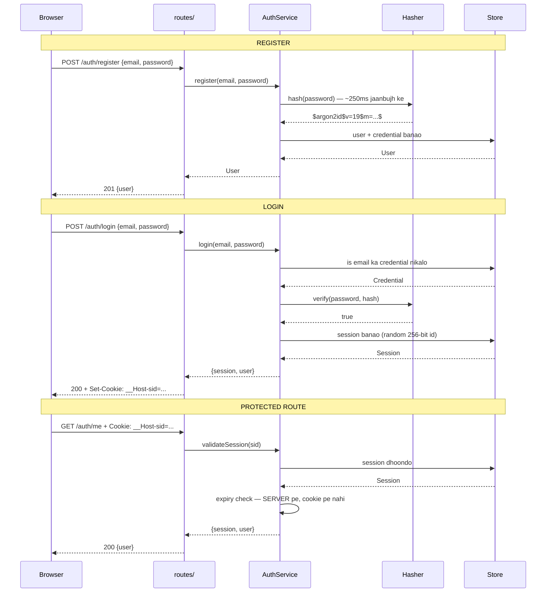
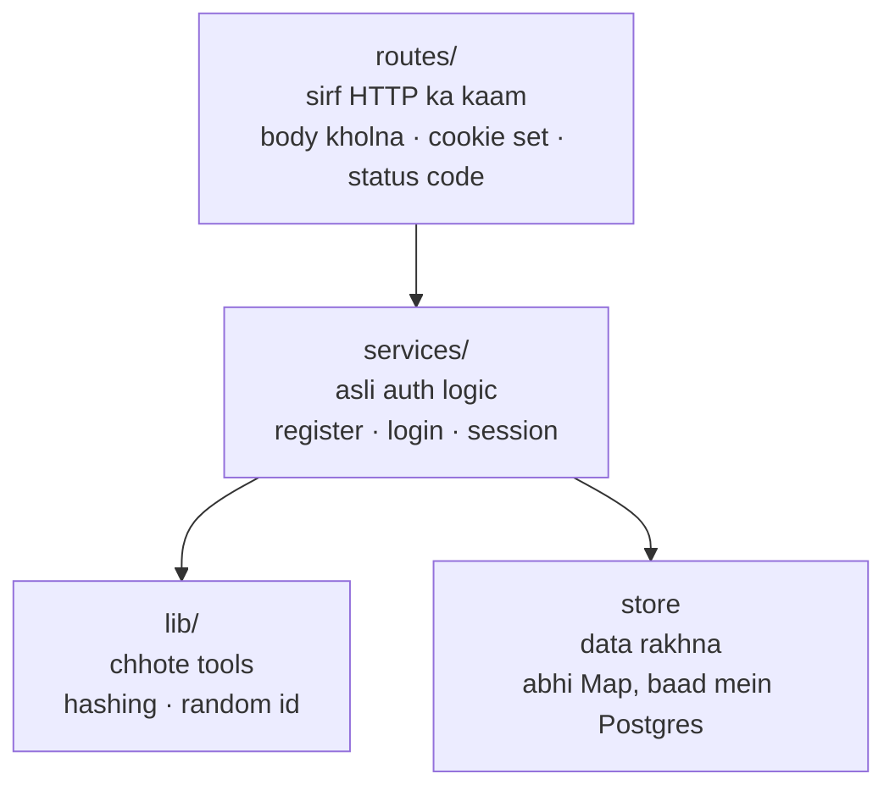

# Phase 1 — Module 1 Design

> **Status:** discussion — code likhne se pehle iske har hisse pe clarity chahiye.
> Sawaal ya disagreement ho toh yahi discuss karenge, phir build karenge.

---

## 1. Is phase mein kya ban raha hai

Char endpoint. Bas. Isse zyada nahi.

```
POST /auth/register    naya user banana
POST /auth/login       password check karke session dena
GET  /auth/me          "main kaun hoon?" — protected route
POST /auth/logout      session khatam karna
```

**Kya NAHI ban raha is phase mein** (aur kyun nahi) — scope ko rok ke rakhna zaroori hai:

| Cheez | Kab banega | Abhi kyun nahi |
|---|---|---|
| JWT / access token | Module 2 | Pehle stateful session samajhna hai, tabhi stateless ka fayda dikhega |
| Rate limiting | Module 3 | Pehle attack karke dekhenge, phir fix karenge |
| Google login | Module 4 | Apna login pehle solid ho |
| MFA / OTP | Module 5 | — |
| Postgres | Phase 1 ke end mein | Pehle memory mein banayenge, interface clear hoga |
| Redis | Module 3 | Rate limiting ke saath aayega, tabhi uska kharcha wasool hoga |
| Multi-tenant | Module 5 | Abhi har query mein `tenant_id` daalna jaldbaazi hai |

---

## 2. Core problem — sab kuch isi se nikalta hai

**HTTP ki yaadasht nahi hoti.** Har request naya insaan hai server ke liye.

```
Request 1:  "main rohan hoon, password hunter2"     server: "theek hai, verified"
Request 2:  "mera profile dikhao"                   server: "tu kaun hai bhai?"
```

Do request ke beech server bhool gaya. TCP connection reuse hota hai, par wo *transport* hai — *identity* nahi. Connection toot bhi sakta hai, load balancer doosre server pe bhej bhi sakta hai.

**Toh asli sawaal ye hai:**

> User ek baar password dega. Uske baad har request pe use kaise pehchanein — **bina password dobara mange**?

Is ek sawaal ke do jawab hain, aur yahi Module 1 vs Module 2 ka farak hai:

```
Jawab A:  client ko ek BEMATLAB random ID do
          asli jaankari server pe rakho, ID se dhoondo          ← SESSION (Module 1)

Jawab B:  client ko ek SIGNED (sealed) parchi do
          jaankari parchi mein hi hai, signature se verify karo  ← JWT (Module 2)
```

Hum abhi **Jawab A** bana rahe hain.

### Jawab A kyun pehle?

Kyunki cookie mein kuch bhi *matlab wali* cheez daalna galat hai:

```
Set-Cookie: user_id=42          ← user isko 43 kar dega. Khel khatam.
Set-Cookie: user=rohan&admin=1  ← wahi baat, thoda ghuma ke
```

Client apni poori request control karta hai. Toh do hi raaste hain:

```
value ko BEMATLAB banao      →  random ID, server pe lookup    [Session]
value ko NAKLI-PROOF banao   →  signature, crypto se verify    [JWT]
```

---

## 3. Poora flow — ek nazar mein



---

## 4. Layers — kaun kiska kaam karega



**Ek hi niyam:** arrow neeche jata hai, upar kabhi nahi.

`services/` ko pata hi nahi ki HTTP kya hai, cookie kya hai.

```ts
// ✅ sahi
class AuthService {
  async login(email: string, password: string): Promise<AuthenticatedSession>
}

// ❌ galat
class AuthService {
  async login(req: FastifyRequest, reply: FastifyReply)
  //          ^^^^^^^^^^^^^^^^^^^^ ab Google callback ise use nahi kar sakta
}
```

### Ye niyam kyun — asli wajah

Module 4 mein Google login aayega. Session tab bhi banana hai, par password nahi hoga:

```
POST /auth/login       ──┐
GET  /oauth/callback   ──┼──►  AuthService.createSession(user)
admin impersonate      ──┘          (logic SIRF ek jagah)
```

Agar `createSession` ne cookie khud set ki hoti, toh Google callback use nahi kar pata — copy-paste karna padta. Phir expiry 7 din se 30 din karni ho toh **do jagah** badalni padti. Ek bhool gaya = bug.

**Doosra fayda:** test bina server ke chalte hain. `new AuthService(...)` — na port, na HTTP. Isliye milliseconds mein.

---

## 5. Data ka shape

```
┌─────────────────────┐         ┌──────────────────────────┐
│ User (pehchaan)     │         │ Credential (saboot)      │
├─────────────────────┤         ├──────────────────────────┤
│ id                  │◄────────│ userId                   │
│ email               │  1 se   │ type: 'password'         │
│ emailVerifiedAt     │  kitne  │ secret: $argon2id$...    │
│ createdAt           │  bhi    │ createdAt                │
└─────────────────────┘         └──────────────────────────┘
         ▲
         │ 1 se kitne bhi
         │
┌────────┴────────────────────┐
│ Session (login ki parchi)   │
├─────────────────────────────┤
│ id          ← random 256bit │  ye cookie mein jata hai
│ userId                      │
│ expiresAt   ← SERVER truth  │
│ lastSeenAt  ← idle timeout  │
│ ip, userAgent ← sirf audit  │
└─────────────────────────────┘
```

### User aur Credential alag kyun?

Seedha tarika ye hota — `password_hash` ko `users` mein hi daal do. Par Module 5 mein passkey aayega, aur ek user ke paas ek saath ye sab honge:

```
rohan@kpoint.com ──┬── password  ($argon2id$...)
                   ├── passkey   (public key)
                   └── google    (google user id)
```

Ek column mein teen cheezein nahi aayengi. Aur baad mein badalna matlab **sabse zyada use hone wali table** ko migrate karna — production mein sabse risky kaam. Abhi ek join ka kharcha, baad mein bada bachao.

### Session mein extra columns kyun?

`lastSeenAt`, `ip`, `userAgent` abhi use nahi honge. Par:
- `lastSeenAt` → idle timeout (Module 1 ke end mein)
- `ip`, `userAgent` → Module 3 mein anomaly detection, Module 5 mein "meri devices" list

Abhi daalna sasta hai. Baad mein `ALTER TABLE` karna mehnga.

---

## 6. Session ID — yahan galti nahi kar sakte

Poora system isi pe tika hai ki ID **guess na ho sake**.

```
❌ Math.random()          predictable hai — kuch output dekh ke aage guess ho jata hai
❌ uuid v1 / v7           time + counter se banta hai, structured hai
❌ auto-increment (1,2,3) session 41 hai toh 42 bhi hoga

✅ crypto.randomBytes(32) CSPRNG, 256 bits
```

**CSPRNG** = *Cryptographically Secure Pseudo-Random Number Generator*. Matlab aisa random jiska **agla output pichle outputs dekh ke bhi guess na ho**.

`Math.random()` fast hai, dekhne mein random lagta hai — par uska formula fixed hai. Kaafi output dekh lo toh aage ka pata chal jata hai. Dice roll ke liye theek, **secret ke liye zeher**.

**256 bits kyun:** OWASP minimum 128 hai. 256 pe guess karna "mushkil" nahi — **ganit se namumkin** hai. Ye poore system ka sabse sasta strong decision hai, isme kanjoosi karne ka koi matlab nahi.

---

## 7. Cookie ke flags — har ek ka apna kaam

```
Set-Cookie: __Host-sid=k7Fq2m...; HttpOnly; Secure; SameSite=Lax; Path=/; Max-Age=604800
            └────┬────┘ └──┬──┘   └───┬──┘  └──┬─┘  └─────┬────┘
              prefix     data      JS se    sirf    doosri site
                                   chhupa   HTTPS   se POST band
```

| Flag | Kis hamle se bachata hai | Kya NAHI rokta |
|---|---|---|
| `HttpOnly` | XSS **cookie chura** nahi sakta | XSS khud — script phir bhi chalega |
| `Secure` | Network pe plain text mein nahi jayega | — |
| `SameSite=Lax` | Doosri site se POST (CSRF) | Browser-based hai, server guarantee nahi |
| `__Host-` prefix | Subdomain cookie nahi daal sakta | Cross-subdomain SSO ab nahi ho payega |

### `HttpOnly` pe sabse badi galatfehmi

Log samajhte hain `HttpOnly` XSS rok deta hai. **Nahi rokta.**

```
XSS chala user ke logged-in page pe
      │
      ├─► document.cookie padhna ......... ❌ BLOCKED
      │
      └─► fetch('/account/email', {...})  ✅ CHAL JAYEGA
              │
              └─► browser cookie KHUD attach kar dega
                        │
                        └─► attacker session CHURA nahi sakta
                            par USE kar sakta hai
```

Matlab: attacker session apne laptop pe le nahi ja sakta, **par user ke browser ke andar rehke sab kar sakta hai** — email badal de, API key bana le.

`HttpOnly` ne *permanent account takeover* ko *session-ke-time-tak ka nuksaan* bana diya. Ye asli fayda hai, par **fix nahi hai**. XSS ka fix XSS ko hone hi na dena hai → Module 3.

### Ek aur zaroori baat — expiry

```
Cookie ka Max-Age  →  sirf dikhawa. User isko edit kar sakta hai.
Server ka expiresAt →  ASLI control
```

Chori hui cookie ka attacker `Max-Age` badal hi dega. Isliye **expiry check hamesha server pe**, cookie pe bharosa nahi.

---

## 8. Do attack jinka jawab design mein hona chahiye

### (a) Session Fixation

Attacker **apni jaani-pehchani** session ID victim ko chipka deta hai.

```
1. attacker ek valid (bina-login wali) session id S le leta hai
2. victim ke browser mein S daal deta hai
3. victim login karta hai
4. server usi S ko "logged in" mark kar deta hai        ← YAHI BUG HAI
5. attacker ab S use karke victim ban gaya
```

**Fix — login pe session ID badlo:**

```
login safal:
    purani id  → mitao
    nayi id    → randomBytes(32)
    cookie mein nayi id bhejo
```

Attacker ke paas jo ID thi wo **theek us waqt mar gayi jab uski keemat banne wali thi.**

Ye sirf login pe nahi — **har privilege change pe** karna hai: password badalna, MFA complete hona, role badalna.

### (b) Account Enumeration — aur timing ka jaal

Agar server bole *"is email ka account nahi hai"* — toh attacker 10 lakh email daal ke **list bana lega** ki kaun-kaunsi registered hain. Phir un pe attack.

Isliye dono case mein **ek hi message**: `"Invalid email or password."`

**Par sirf message se kaam nahi chalega.** Seedha code likhne pe ye hota hai:

```ts
const cred = store.findCredentialByEmail(email)
if (!cred) return false              // ← microseconds mein wapas
return hasher.verify(password, ...)  // ← 250ms lagta hai
```

Attacker message nahi, **ghadi dekhega**:

```
jaldi jawab aaya  →  account hai hi nahi
der se jawab aaya →  account HAI, isi pe attack karo
```

Message ek jaisa, par **time ne raaz khol diya**.

**Fix:** user na mile tab bhi ek nakli hash ke against verify chalao, taaki dono raaste ka time barabar rahe.

```
user mila      →  asli hash se verify   (~250ms)
user nahi mila →  DUMMY hash se verify  (~250ms)   dono same
```

---

## 9. Storage — abhi Map, baad mein Postgres

Abhi in-memory (`Map`) se shuru kar rahe hain. **Jaanbujh ke, aur temporary.**

| | In-memory | Postgres | Redis |
|---|---|---|---|
| Speed | ~microseconds | ~1-5ms | ~0.1-1ms |
| Restart ke baad bachta hai | ❌ | ✅ | ✅ |
| Multi-server | ❌ | ✅ | ✅ |
| Expiry khud hoti hai | ❌ | ❌ (cron chahiye) | ✅ (native TTL) |

**In-memory production ke liye bilkul galat hai:**

```
   EK SERVER (chal jayega)          KAI SERVER (asli duniya)

   Client ──► Server A              Client ──► Load Balancer
              [session RAM mein]                     │
                  ✓ mila                    ┌────────┼────────┐
                                            ▼        ▼        ▼
                                        Server A  Server B  Server C
                                        [RAM: S]  [khali]  [khali]
                                            ✓       ✗ 401    ✗ 401
                                                 random logout ho jayega
```

Aur deploy karte hi sabka session udd jayega.

**Toh phir pehle memory kyun?** Kyunki isse **interface saaf dikhta hai** bina infrastructure ke jhamele ke. Phir Postgres laayenge — aur tab pata hoga ki interface mein kya chahiye, guess nahi karna padega.

**Plan:** memory → Postgres (is phase ke end mein) → Redis (Module 3, jab rate limiting ke liye waise bhi chahiye hoga).

---

## 10. Abhi tak code mein kya hai

```
src/
├── config.ts              ✅ settings, galat ho toh app start nahi hogi
├── core/
│   ├── types.ts           ✅ User, Credential, Session ka shape
│   └── errors.ts          ✅ AuthError — public vs internal message
├── lib/hashing/
│   ├── hasher.ts          ✅ interface
│   ├── argon2-hasher.ts   ✅ default (memory-hard)
│   ├── bcrypt-hasher.ts   ✅ comparison + migration
│   └── hashing.test.ts    ✅ 17 test PASS
└── services/
    ├── user-store.ts      ✅ in-memory store
    ├── auth-service.ts    ⬜ 3 function KHALI — yahi agla kaam hai
    └── auth-service.test.ts  ❌ 11 test FAIL (jaanbujh ke — yahi target hai)
```

### Benchmark se kya pata chala

`pnpm bench:hash` tere laptop pe:

| | verify time | matlab |
|---|---|---|
| Argon2id 64MiB | 37ms | prod ke liye kam |
| **bcrypt cost=12** | **132ms** | **3.5x slow, phir bhi kamzor** |
| Argon2id 256MiB | 200ms | sahi range |

Beech wali line important hai. bcrypt **zyada time** leta hai par **kam surakshit** hai:

- bcrypt → sirf **CPU** khata hai
- Argon2id → CPU **+ 64 MiB RAM** har hash pe

Attacker ke GPU mein 10,000 core hote hain — CPU ka kaam 10,000 guna tez. **Par RAM nahi badha sakta.** 64 MiB × 10,000 = 640 GB. Itni RAM GPU mein hoti hi nahi.

> **Argon2 time se nahi, RAM se jeeta.**

Isliye **wall-clock time se algorithms compare karna galat hai** — sirf ek hi algorithm ke andar compare kar sakte hain.

**Catch:** 256 MiB ek hash ka. 10 log ek saath login kare = 2.5 GB RAM. Isliye default 64 MiB rakha, `.env` se badalne layak. Asli tuning production server pe hogi.

---

## 11. Build ka order

```
1. ✅ Hasher              ho gaya, 17 test pass
2. ⬜ register + verify   ← ABHI YAHAN (11 test fail ho rahe hain)
3. ⬜ Session banana      in-memory
4. ⬜ Fastify routes      cookie ke saath
5. ⬜ /auth/me + logout   protected route + rotation
6. ⬜ Postgres            Map ki jagah asli DB
```

Har step ke baad test pass hone chahiye, tabhi aage.

---

## 12. Faisle jo le liye — aur unki wajah

| Faisla | Kyun | Kya kharcha |
|---|---|---|
| pnpm | Phantom dependency rokta hai, install script block karta hai | — |
| Argon2id default | Memory-hard, OWASP #1 | Native build chahiye |
| bcrypt bhi banaya | Comparison + migration seekhne ke liye | Thoda extra code |
| `Hasher` interface | Algorithm migration bina password reset ke | — |
| User ≠ Credential | Module 5 mein passkey aayega | Ek join |
| In-memory pehle | Interface saaf dikhega | Baad mein badalna padega (yahi plan hai) |
| Layers (routes/services/lib) | Module 4 mein OAuth wahi service use karega | Thoda zyada file |
| `__Host-` prefix | Subdomain cookie tossing namumkin | Cross-subdomain SSO nahi hoga |
| Abhi multi-tenant nahi | Query pata nahi abhi, guess nahi karenge | Module 5 mein add karna padega |

---

## 13. Sawaal — inka jawab chahiye aage badhne se pehle

1. **Ye scope theek hai?** Char endpoint, session-based, in-memory se shuru. Koi cheez add/remove karni hai?

2. **Layer wala niyam samajh aaya?** Ki `AuthService` ko HTTP ka pata nahi hona chahiye — aur Module 4 mein iska fayda kya hoga.

3. **Do attack clear hain?**
   - fixation → login pe ID badlo
   - enumeration → same message **aur** same timing

4. **In-memory se shuru karna theek hai**, ya seedha Postgres chahiye?

5. **Agla code kaun likhega?** Tu `auth-service.ts` ke 3 function likhega (guidance already comments mein hai), ya main likhun aur saath mein padhein?

---

## Reference

- [Module 1 ke poore notes](../notes/module-1-authentication-foundations/)
- [Roadmap PDF](../Authentication%20Engineering%20Roadmap.pdf)
