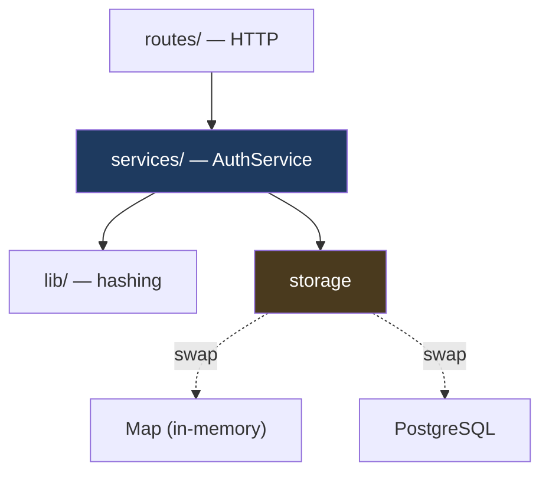

# Sprint 1, increment 2 — Postgres Persistence

> **Status:** ✅ shipped as `v0.1.1`. See §11 for what building it actually taught.

---

## 1. Why now

`v0.1.0` works and is unshippable. Two `Map`s hold every user and session in **one
process's memory**:

```
  RESTART                           TWO INSTANCES
  ───────                           ─────────────
  pnpm dev  →  everyone logged out   Client ──► Load Balancer
  deploy    →  everyone logged out              │
  crash     →  everyone logged out      ┌───────┼───────┐
                                        ▼       ▼       ▼
  All users gone too — they must      Server A  B       C
  re-register, not just re-login      [has S] [empty] [empty]
                                         ✓      401     401
```

Note the users vanish as well, which is worse than the sessions. A session loss is an
inconvenience; an account loss is data loss.

This is the exact failure the notes described in theory
([7-session-storage](../notes/module-1-authentication-foundations/7-session-storage/notes.md)).
Now we fix it.

---

## 2. What changes — and what must not



**Only the storage layer changes.** `AuthService` should not gain a single SQL statement,
and `routes/` should not change at all.

That is the test of whether the layering from `v0.1.0` was real or decorative. If adding
Postgres forces edits to `auth-service.ts` business logic, the boundary was in the wrong
place.

**One unavoidable change:** the store methods become `async`, because a network round-trip
cannot be synchronous. That ripples into `AuthService` signatures — `validateSession`
becomes `async` — and into the routes that call it. Mechanical, but real.

---

## 3. The interface question

Right now there is no `SessionStore` interface — deliberately, from the earlier decision
*"we have one implementation and no evidence for what a second needs."*

Now we have the evidence. Two implementations exist, so the interface can be **extracted
from reality** rather than guessed:

```ts
interface SessionStore {
  create(session: Session): Promise<void>
  findById(id: SessionId): Promise<Session | undefined>
  update(session: Session): Promise<void>
  delete(id: SessionId): Promise<void>
  deleteAllForUser(userId: UserId): Promise<number>
}
```

**Why keep the in-memory one at all?** Tests. 74 tests currently run in ~300ms with no
database. Pointing them all at Postgres would make the suite slow, require a running
container in CI, and couple unit tests to infrastructure.

**The cost, stated honestly:** two implementations can drift. A bug fixed in one may live
on in the other, and tests passing against `Map` do not prove Postgres works. The
mitigation is a shared **contract test suite** run against both — which is itself extra
machinery.

---

## 4. Driver: raw `pg` or Prisma?

The roadmap specifies Prisma. Worth understanding the trade before accepting it.

| | raw `pg` | Prisma |
|---|---|---|
| SQL visible | **yes — you write it** | generated, hidden |
| Learning value | **high** | lower — the ORM does the thinking |
| Type safety | manual (you cast rows) | **generated from schema** |
| Migrations | write SQL by hand | **`prisma migrate`** |
| Setup cost | tiny | schema file + generate step |
| Debugging | what you wrote is what runs | needs `?log=query` to see SQL |

**Recommendation: Prisma**, for two reasons specific to this project.

1. **The roadmap specifies it**, and Module 6's deliverable is a 16-table schema with
   relationships. Hand-writing that migration set is busywork, not learning.
2. **Migrations are the real value.** Module 5 adds passkeys, MFA methods, recovery codes
   — each an additive migration against a table with live data. That is a skill worth
   having, and `prisma migrate` teaches the workflow.

**What we lose:** you stop writing SQL, so you stop *seeing* what a query costs. Mitigation
— turn on query logging in dev and actually read the emitted SQL for the session lookup.
An auth service does one query per request; you should know what it looks like.

---

## 5. Schema

Only the three tables Module 1 needs. Module 6 adds the other thirteen.

```
┌──────────────────────┐
│ users                │
├──────────────────────┤
│ id          UUID PK  │
│ email       CITEXT ∪ │ ← unique, case-insensitive
│ email_verified_at    │
│ created_at           │
│ updated_at           │
└──────────┬───────────┘
           │ 1:N
     ┌─────┴──────────────────────┐
     ▼                            ▼
┌──────────────────────┐  ┌──────────────────────────┐
│ credentials          │  │ sessions                 │
├──────────────────────┤  ├──────────────────────────┤
│ id          UUID PK  │  │ id          TEXT PK      │ ← the 256-bit CSPRNG value
│ user_id     FK ─────►│  │ user_id     FK ─────────►│
│ type        ENUM     │  │ expires_at   ⊙           │ ← indexed (reaper)
│ secret      TEXT     │  │ last_seen_at             │
│ created_at           │  │ created_at               │
│ updated_at           │  │ ip, user_agent           │
└──────────────────────┘  └──────────────────────────┘
   ∪ unique(user_id,type)      ⊙ index on user_id too
```

### Decisions worth arguing about

**`email` uniqueness in the database, not application code.**

`v0.1.0` checks `if (emailIndex.has(email))` then inserts. Single-threaded JS makes that
atomic *by accident*. Postgres will not:

```
  t=0  request A: SELECT ... WHERE email='x'  →  not found
  t=1  request B: SELECT ... WHERE email='x'  →  not found
  t=2  request A: INSERT                      →  ok
  t=3  request B: INSERT                      →  ok      ← two accounts, one email
```

A `UNIQUE` constraint makes the second insert fail at the database. The app then catches
the constraint violation and converts it to `EMAIL_ALREADY_REGISTERED`. **The database is
the arbiter; the application check becomes an optimisation, not a guarantee.**

**Session `id` is the CSPRNG value itself, not a surrogate UUID.**

The 256-bit random value already *is* a primary key: unique, unguessable, generated by us.
Adding a separate `id` column would mean two keys for one row and an extra index.

Trade-off: it is a 43-character TEXT primary key rather than a compact UUID, so indexes are
slightly larger. Irrelevant at this scale, worth knowing at 100M sessions.

**`CITEXT` vs application lowercasing.**

We already lowercase in `normaliseEmail()`. `CITEXT` makes the *database* case-insensitive
too, so a future code path that forgets to normalise still cannot create a duplicate.

Belt and braces: the app normalises for consistent storage; the DB enforces uniqueness
regardless. Cost is an extension (`CREATE EXTENSION citext`) and slightly slower
comparisons.

*Alternative considered:* plain `TEXT` with a functional unique index on `lower(email)`.
Equivalent guarantee, no extension needed. Either is defensible.

---

## 6. The reaper — the thing with no in-memory analogue

Expired sessions are already rejected by `validateSession`. So a missing cleanup job
produces **no functional bug**:

```
  no reaper  →  all tests pass
             →  no user-visible error
             →  sessions table grows forever
             →  index degrades slowly
             →  noticed months later, under load
```

Silent, gradual, and invisible to every test — which is exactly why it needs to be a
deliberate decision now rather than a discovery later.

Three options:

| Approach | How | Trade-off |
|---|---|---|
| **App-side interval** | `setInterval` in the Node process | Simple; every instance runs it, duplicating work |
| **`pg_cron`** | Scheduled inside Postgres | Clean, but an extension and DB-level config |
| **External cron** | A `DELETE` on a schedule | Standard in production; more moving parts |

Recommendation for now: **app-side interval, opt-in via config**, off in tests. Honest
about it being the naive option — Module 6's deployment work is where this becomes a
proper scheduled job.

---

## 7. Local infrastructure

Docker Compose. Note your machine already runs Postgres on **5433** (`lockedin-db`), so
TurtleAuth needs a different port — **5434** — or the container will fail to bind.

```yaml
services:
  postgres:
    image: postgres:16-alpine
    ports: ["5434:5432"]
    environment:
      POSTGRES_DB: turtleauth
      POSTGRES_USER: turtleauth
      POSTGRES_PASSWORD: turtleauth   # local only; never a real secret
    healthcheck:                       # so `up -d` means "ready", not "started"
      test: ["CMD-SHELL", "pg_isready -U turtleauth"]
```

A named volume persists data across `docker compose down`. `down -v` wipes it.

---

## 8. Testing strategy

The hard question: **how do the 74 existing tests stay fast?**

```
  unit tests (74)          → in-memory stores, no DB, ~300ms      unchanged
  contract tests (new)     → run the SAME suite against BOTH      catches drift
  integration tests (new)  → real Postgres: constraints, reaper   needs container
```

The contract suite is what stops the two implementations diverging. Without it, "tests
pass" means "the `Map` version works", which is not the version that ships.

**Cost:** integration tests need a running container, so they are opt-in locally and gated
in CI. A test suite that fails when Docker is down trains you to ignore red.

---

## 9. Order of work

```
1. docker-compose.yml + health check              infra first, verify it boots
2. Prisma schema + first migration                 tables exist
3. Extract SessionStore / UserStore interfaces     from the two real implementations
4. Postgres implementations                        the actual work
5. Make AuthService async                          ripples to routes
6. Contract tests against both                     prove they agree
7. Reaper + config                                 the silent one
8. End-to-end verification against a live server   curl, like last time
```

---

## 10. Decisions

| Question | Decision | Consequence accepted |
|---|---|---|
| Driver | **Prisma** | Less SQL visible — mitigated by query logging in dev |
| Keep in-memory store? | **No — Postgres only** | Tests need Docker and get slower; in exchange they exercise what actually ships and no drift is possible |
| Email uniqueness | **CITEXT + UNIQUE** | An extension, and the DB is the arbiter rather than app code |
| Reaper | **Deferred** → [#1](https://github.com/THEROHAN01/turtleauth/issues/1) | Table grows unbounded until closed; blocks nothing before deployment |
| Port | **5434** | 5433 is taken by `lockedin-db` |

### On dropping the in-memory store

The 74 tests currently run in ~300ms with no infrastructure. Against Postgres they become
seconds and require a running container.

What that buys: **tests exercise the code that ships.** A passing suite against `Map` never
proved the SQL path worked, and two implementations would have needed contract tests to
stop them drifting — machinery that is itself a maintenance cost.

Mitigation for the friction: container lifecycle is scripted (`pnpm db:up`), and a stopped
Docker produces a clear message rather than a confusing cascade of failures.


---

## 11. What building it taught

### The layering held

`AuthService` gained no SQL and `routes/` gained no logic — only `await`. The §2
prediction was right: the boundary was real, not decorative.

The one unavoidable ripple was async. Store methods became `Promise`-returning, which
propagated to `validateSession`, `logout`, `logoutAll`, and every route calling them.
Mechanical, as predicted.

### Prisma 7 moved the goalposts

Two breaking changes from what the roadmap assumes:

| | Prisma 6 and earlier | Prisma 7 |
|---|---|---|
| Connection URL | `url` in `schema.prisma` | `prisma.config.ts` + driver adapter |
| Runtime | bundled query engine | `@prisma/adapter-pg` over a `pg` pool |

Net effect is better: the schema file is environment-agnostic and cannot carry a
connection string into version control, and the pool is ours to size.

Also: npm's `latest` tag for `prisma` currently points at an `8.0.0-rc`, so a plain
`pnpm add prisma` resolved the CLI to a prerelease while the client stayed on 7. Pinned
both to `7.10.0`. Worth checking `dist-tags` rather than trusting `latest` for anything
load-bearing.

### The schema-isolation failure

The plan in §8 was a schema per test file. It does not work, and the reason is worth
keeping:

**Prisma's generated client bakes `schema.prisma`'s schema name into its SQL and ignores
`search_path`. Raw queries honour it.** So setup wrote to one schema and the code under
test wrote to another, and a brand-new empty schema reported `EMAIL_ALREADY_REGISTERED`.

Settled on one shared schema with `fileParallelism: false`. Cost is wall-clock
(~300ms → ~7s), not correctness.

Generalises beyond tests: schema-per-tenant on Prisma needs a client per schema.

### Debugging note

Several minutes went into chasing `search_path` before probing what Prisma actually
emitted. `SHOW search_path` proved the connection was configured correctly, which is what
redirected attention to the client rather than the pool.

A stale row in `public.users`, left by the first broken run, then masked the fix — the
suite kept failing after the real problem was solved. **When a fix does not take, check
whether earlier failures left state behind** before assuming the fix is wrong.
